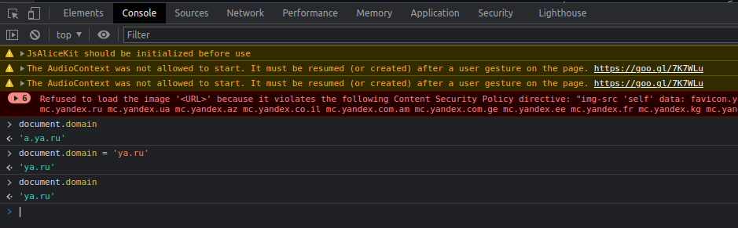
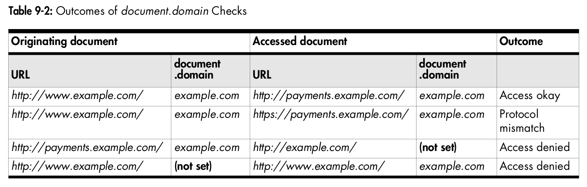
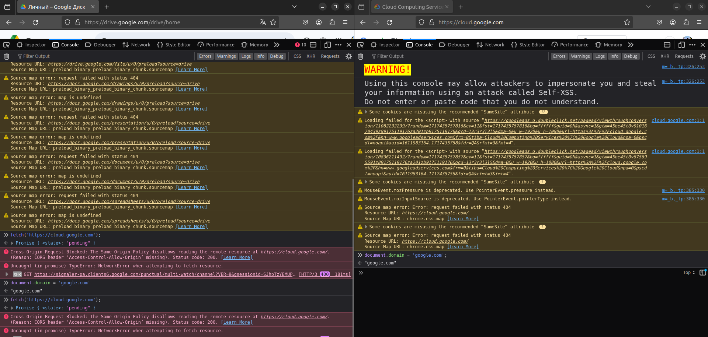

# *Domain Lowering*
***Domain Lowering*** позволяет обходить *SOP* для источников с одинаковы доменом 2-ого уровня. Так появляется возможность игнорировать отличие в разнице источников `john.site.com`, `peter.site.com` и `site.com`, т.к. они имеют общий домен 2-ого уровня `site.com`.


### Базовые концепции
  - Супердомен *(superdomain)* - это *Top Level Domain (TLD)* + еще один домен верхнего уровня, сокращенно обозначается как *TLD+1*, напрмиер, для `drive.google.com` супердоменом будет `google.com`.


### Св-во `document.domain`
Св-во возвращает домен текущего источника. Зачастую, это будет просто домен *URL* страницы, однако есть несколько исключений:
  1) Если страница имеет неявный источник, то св-во верёт пустую строку, например, для ссылок вида `file://` или `data://`;
  2) Если св-во `document.domain` было предварительно перезаписано, то вернется новое значение.

Например, для `https://developer.mozilla.org/en-US/docs/Web`:
```js
console.log(document.domain); // developer.mozilla.org
```

Изменение св-ва `document.domain` возможно только на значение того же источника или на значение родительского. Например, для `https://a.example.com` и `https://b.example.com`, значение может быть изменено:
```js
document.domain = "example.com";
```

Наглядный пример для источника `https://a.ya.ru`:


В этом и заключается *domain lowering*. Если каждый из поддоменов изменит свой `document.domain`, то родительский домен и поддомены получат возможность иметь доступ к содержимому *DOM* друг друга. Важно, чтобы каждый из доменов явно изменил это св-во, так, это должен сделать даже источник с *TLD+1* `https://example.com`, наглядно в сл. таблице:



### Безопасность
Комментарий из документации, важно подчеркнуть, что св-во также удаляет порт из значения источника!

> Attempting to set `document.domain` is dangerous. It opens up full access to a page's DOM from all subdomains, which is likely not what is intended. It also removes the port component from the origin, so now your page can be accessed by other pages with the same IP address or same host component, even on a different port.

Выставленеи св-ва `document.domain` особенно небезопасно на поддоменах, живущих на ресурсах совместного хостинга:

> Similar problems occur with shared hosting sites that give each customer a different subdomain. If a site sets `document.domain`, any other customer on a different subdomain can now do the same thing, and start accessing the data of the original site.


### Вопросы
  1) Я меняю `document.domain` на стороне клиента (из *JS*-кода). Как тогда *JS* из другого источника определяет значение источника др. ресурса? Условно, я смогу сделать `fetch`, находясь на `example.com` (с учетом того, что я уже сделал *domain lowering*)?
        ```js
        fetch('https://a.example.com').then(...)
        ```
        <u>*Answer:*</u> нет, так сделать не получилось, но почему?
        
  2) Что значит, что св-во *depricated*. Его нельзя использовать в новых версиях браузеров?
  3) Можно ли поменять `document.domain` не на *TLD+1*, а на *TLD+2* (при этом находясь на *TLD+3*)? <u>*Answer:*</u> нет, это св-во позволяет менять свое значение только на *TLD* с *TLD+1*;
  4) Почему нужно обязательно выставить св-во даже на супердомене? <u>*Answer:*</u> потому что св-во перезаписывает номер порта для источника в `null`, см. комментарий из документации, [ссылка](https://developer.mozilla.org/en-US/docs/Web/Security/Same-origin_policy#changing_origin):
  
      > The port number is checked separately by the browser. Any call to document.domain, including `document.domain` = `document.domain`, causes the port number to be overwritten with `null`. Therefore, one cannot make `company.com:8080` talk to `company.com` by only setting `document.domain = "company.com"` in the first. It has to be set in both so their port numbers are both `null`.


### Источники
  1) Документация по `document.domain`, [ссылка](https://developer.mozilla.org/en-US/docs/Web/API/Document/domain)
  2) `document.domain` от `learn.javascript`, [ссылка](https://learn.javascript.ru/cross-window-communication#okna-na-poddomenah-document-domain)
  3) *Changing Origin MDN*, [ссылка](https://developer.mozilla.org/en-US/docs/Web/Security/Same-origin_policy#changing_origin)
