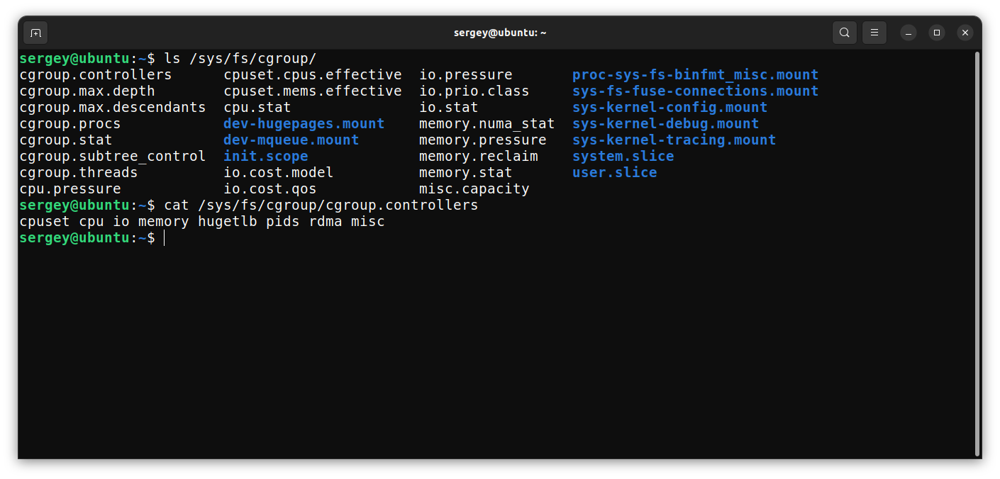
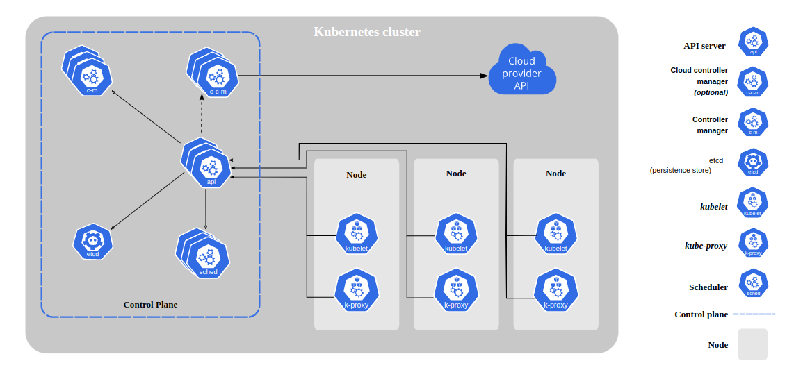

## Виртуализация
**Гипервизор** — технология развертывания программного обеспечения на физическом оборудовании с использованием виртуализации.

**Контейнер** — изолированное средствами ОС множество процессов и файлы, необходимые для их существования.

* Полная виртуализация, гипервизоры бывают 2-ух типов: 
    + *Тип 1* (аппаратные гипервизоры), гипервизоры этого типа работают на аппаратном уровне бех необходимости установки какой-либо ОС на хост (*Hyper-V*, *VMWare ESXi*, *KVM*). Основная проблема с которой можно столкнуться при использовании гипервизоров этого типа это то, что гипервизоры этого типа не совместимы с гипервизорами *типа 2*, например, *Credentials Guard* работает на основе *Hyper-V*;
    + *Тип 2*, т.е. гипервизоры, которые работают поверх хостовой ОС (*VirtualBox*, *VMware Workstation*, *OpenVZ*).
    
    **Плюсы:** полноценная ОС (любая), сложнее провалиться в хост-систему. **Минусы:** медленное развертывание, неэкономично, новый *attack surface* и *vuln. management*;
* Паравиртуализация - гипервизор имеет специальный *API* с которым общается клиентская ОС, ~~такая схема будет работать быстрее обычной виртуализации~~ (*Xen*). Но для этого нужно патчить ядро клиентской ОС (невозмо в случае закрытого исходного кода, например, *Windows*).
* Виртуализация на уровне ОС (контейнеризация) - используется единое ядро, т.е. все контейнеры запускаются на одном ядре (в случае полноценной виртуализации у каждой виртуальной машины свое ядро) (*LXC* - концепция полноценной выритуальной машины, *Docker* - *application* контейнер ...; *Rocket*). **Плюсы:** быстрое развертывание, легковесность. **Минусы:** хуже изоляция, костыли, доступ к ядру.

### Контейнеризация
Если коротко, то в ядре нет такого понятия как контейнер, для ОС это просто запущенный с некоторыми ограничениями процесс. Совместное использование всеми контейнерами на хосте одного ядра (выполнения к нему системных вызовов) вызывает далеко идущие последствия для безопасности. Поэтому следуя принципа минимкма полномочий - существуют средства защиты *Linux*, с помощью которых пользователи могут ограничивать нобор системных вызовов, доступным различным программам.

По умолчанию контейнеры запускаются от имени суперпользователя.

Технологии ограничения контейнеров (процесса):
1. ***Cgroups (Control Groups)*** - контрольные группы - позволяют ограничивать ресурсы. Состоит из ядра и подсистем. Ядро управляет всем, подсистемы бывают разные, какие-то отвечают за память, какие-то за *CPU* и т.д. **Типичная задача:** ограничить процесс по *CPU*. Ниже речь пойдет об устройстве *cgroup v1*:

**Пример:** при создании *LXC*-контейнера в подсистеме */sys/fs/cgroup/memory* и пр. подгруппах создастся директория *lxc*, а в ней директория с именем нового контейнера.  *PID* всех запускаемых в этом контейнере процессов будут записываться в файл */sys/fs/cgroup/cpu/lxc/[имя контейнера]/tasks*. Аналогичным образом дело обстоит с контейнерами *Docker* и другими.

Механизм *cgroups* состоит из двух составных частей: ядра *(cgroup core)* и так называемых подсистем. В ядре версии *4.4.0.21* таких подсистем 12, приведем некоторые из них:
- *devices* — разрешает или блокирует доступ к устройствам, т.е. позволяет ограничивать доступ к девайсам из */dev*;
- *memory* — управляет выделением памяти для групп процессов;
- *net_cls* — помечает сетевые пакеты специальным тэгом, что позволяет идентифицировать пакеты, порождаемые определённой задачей в рамках контрольной группы;
- *pids* — используется для ограничения количества процессов в рамках контрольной группы.

*Cgroup v1* имеет мн-во недостатков, очевидно встраивать контрольную группу в каждую подсистему по отдельности очень неудобно + если мы, например, создаём вложенную контрольную группу, то в некоторых подсистемах настройки родительской группы наследуются (*cpuset*), а в некоторых — нет.

В <u>*cgroup v2*</u> в корневой директории (и в каждой контрольной группе) автоматически создаются следующие управляющие файлы: 
- *cgroup.controllers* — содержит список поддерживаемых подсистем;

В *docker* на современных дистрибутивах используется *cgroup v2*, [см. источник](https://docs.docker.com/config/containers/runmetrics/):
> cgroup v2 is used by default on the following distributions:
> 
>    - Fedora (since 31)
>    - Debian GNU/Linux (since 11)
>    - Ubuntu (since 21.10)

2. ***Namespaces*** - это механизм ядра *Linux*, обеспечивающий изоляцию процессов друг от друга. 

Первая попытка изоляции в *Linux* - *chroot* - системный вызов *chroot()*  и соответствующая команда меняет корневую директорию вызывающего процесса (не подходит для обеспечения безопасности). Программе, запущенной с изменённым корневым каталогом, будут доступны только файлы, находящиеся в этом каталоге. Пример: если задать бинарному файлу новую корневую директорию, то он работать не будет, нужно еще перенести все зависимости (либо статически скомпилировать бинарь). 

Так придумали *Namespaces*, их всего 7 шт. (*mount*, *ipc*, *uts*, *pid* ...). Рассмотрим подробнее некоторые из них:
- *PID* - *PID* процессов;
- *NETWORK* - сетевые устройства, стеки, порты и т.п.;
- *USER* - *ID* пользователей и групп;
- *MOUNT* - точки монтирования. С помощью пространств имён *MOUNT* можно создавать полностью независимые файловые системы,ассоциируемые с различными процессами;
- *IPC* - *SystemV IPC*, очереди сообщений *POSIX*. Применяется для организации общения между процессами;
- *UTS* - имя хоста и доменное имя *NIS*.

3. Union mount - важно для *Docker*, т.к. он работает с образами и каждый образ состоит из нескольких слоев. Если в двух словах, то весь мой образ *R/O* и все, что мы будем записывать будет в верхнем слое *Thin R/W layer*. Так можно делать несколько контейнеров на одном образе, а у каждого контейнера будет свой пишущий слой. Важно понимать, что при наложении файлов берется тот, который находится в слое выше, так, если я хочу поменять что-то в *rootfs*, я просто копирую в вышележащий слой, в котором у нас есть доступ на изменения и меняю все в нем (но в документации это не рекомендуется использовать, рекомендуется *voluemes*);

4. *Capabilities* - разделение прав root-пользователя (раньше был *SUID*) *SUID-bit* - позволяет запусккать бинарь с правами того пользователя, которому он принадлежит (соответственно любая программа с *suid*-битом, принадлежащая *root*-пользователю позволит выполнять действия от его имени). Бит *setuid* - опасный путь для повышения полномочий, поэтому некоторые анализаторы образов контейнеров сообщают о наличии файлов с установленным битом *setuid*. В *docker* можно вообще запретить использование *SUID*, прибегнув к флагу <u>*--no-new-privileges*</u> команды *docker run*.
   *Capability sets*:
   1. *permitted* - *cap*, которые процесс может использовать; 
   2. *inheritable* - *cap*, которые переходят от родительского процесса;
   3. *effective* - ...
   4. *ambient* (только для процессов) - ...
   5. *bounding* - ...

5. *Seccomp (Secure Computing)* - ограничение набора системных вызовов. Скажем в ОС ~400 системных вызовов, чем больше процессу доступно - тем хуже.
   *Seccomp* режимы:
   1. *SECCOMP_MODE_STRICT* - разрешает только три вызова, слабо применим на практике;
   2. *SECCOMP_MODE_FILTER* - позволяет опционально задавать разрешения на вызовы. Должны использовать *BPF (Berkeley Packet Filter* ... ?) ;
   3. *SECCOMP_GET_ACTION_AVAIL* - 

6. *MAC (Mandatory Access Control)* - мандатное разграничение доступа. *MAC* может помочь, если проблема получена не из уязвимости ядра.
   1. *SELinux*
   2. *AppArmor (Linux)* 

### Attack Surface
Мн-во уязвимостей контейнеров связанны с уязвимостиями компонент из которых состоит ПО это: *kernel exploit* *(DirtyCow)*, *runc exploit*, *docker exploit*, подобные уязвимости возникают из-за ошибок при разработке программ под *linux* (*fd leaks*, *symlinks*, *usermode helpers*, *TOCTOU*). К другой крупной категории можно отнести мискофигурации при запуске контейнеров: *excessive capabilities* (*SYS_MODULE*, *SYS_PTRACE*, *SYS_MOUNT*), *--privileged*, монтирование *docker.sock* или */proc*. 

### Угрозы контейнеризации
На каждом из этапов работы с контейнерами могут возникнуть проблемы.
Риски дял на этапе "Образ":
1. Уязвимости в самом образе;
2. Неккоректная конфигурация образа (зачем-то запустили *ssh* или *ftp*);
3. Встроенные секреты;
4. Использование недоверенных образов.

Решение проблемы - ПО для сканирования контейнеров *Clair* или *Trivy*, аналогично для секретов (подстановка переменных окружения через систему оркестрации) и неккоректной конфигурации.

Риски дял на этапе "Хранение (*registry*)":
1. Незащищенное соединение с реестром (открыли *API* по *HTTP*, т.е. прослушивая трафик можно скачать недоступный в паблике образ или прослушать *credentials* для подключения к реестру);
2. Необновленные образы;
3. Проблема с аутентификацией и авторизацией (должно быть разграничение доступа);

Риски дял на этапе "Оркестрация":
1. Отсутствие разграничения доступом;
2. Отсутствие сетевой сегментации (изоляция приложений друг от друга по сети);
3. Ограничение "соседства" контейнеров разного уровня критичности;
4. Доверительные отношения между узлами оркестратора (что-то про запуск образов на хостовой ОС).

Риски дял на этапе "Контейнер":
1. Уязвимости в программах/приложениях;
2. Исходящее соединение;
3. Неккоректная конфигурация контейнеров (самая распространенная проблема для *docker* пошарить *docker.sock*, например, если человек хочет внутри *docker* запускать другие *docker*-контейнеры. Еще бывает открывают *socket* по *tcp*);
4. Посторонние контейнеры (разграничение *prod/dev/test*).

Риски дял на этапе "Хост":
1. Увеличение поверхности атаки (много сервисов - больше боверхность атаки);
2. Общее ядро (уязвимость ядра, проэксплуатированая в любом из контейнеров, автоматически ведет к компроментации хоста);
3. Уязвимости в программах самого хоста;
4. Неккоректное разграниченеи прав доступа на самом хосте;
5. Доступ к ФС из контейнеров (монтирование файловой системы хоста).

## Kubernetis

### Ссылки
1. [Гипервизоры. *Selectel*](https://selectel.ru/blog/what-is-hypervisor/)
2. [Механизмы контейнеризации: *cgroups*. *Habr*](https://habr.com/ru/companies/selectel/articles/303190/)
3. [Механизмы контейнеризации: *namespaces*. *Habr*](https://habr.com/ru/companies/selectel/articles/279281/)
4. 