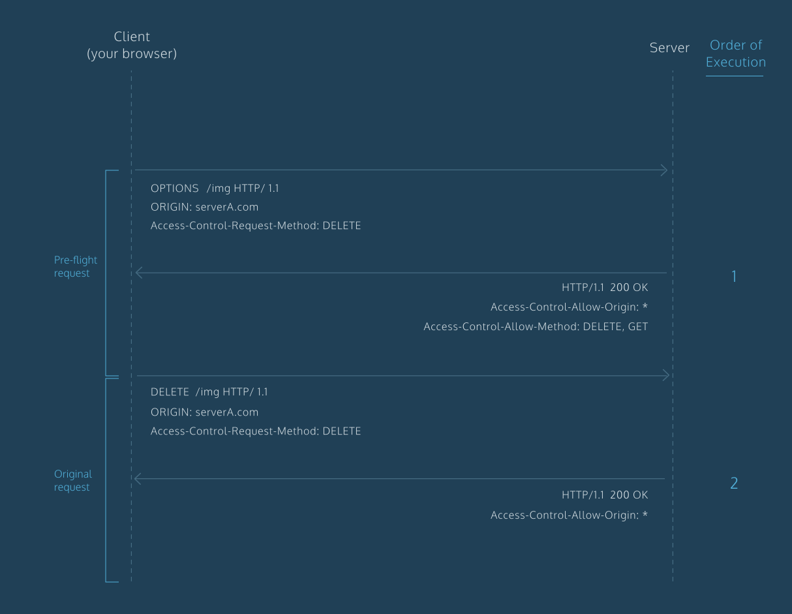

### *SSRF (Server-Side Request Forgery)*
***SSRF (Server-Side Request Forgery)*** - подделка запроса на стороне сервера - атака позволяет отправлять запросы от имени сервера к внешним или внутренним ресурсам. Позволяет злоумышленнику отправлять запросы на ресурсы, даже если они защищены *Firewall*, *VPN* или др. системой управления доступом к сети *(ACL)*.

В лекциях ШкИБ18 *SSRF*-атаки рассматриваются как архитектурные проблемы.

**Как бороться с *SSRF*-атаками?** 1) Контроль схем, ограничение до *http* и *https*, чтобы, например, исключить возможность чтения локальных файлов по схеме *file*; 2) Просматривать доменные именна, запретить доступ к localhost; 3) Запретить http redirections; 4) Валидировать ответ и не сразу отдвавать содержимое. 

Все вышеперечисленные пункты не работают без <u>***Proxy***</u>, нужно просто использовать <u>***Proxy***</u>, который находится за пределами доверенной инфраструктуры. Важно разделение по *UID* с дальнейшим запретом через *firewall* обращения к другим *UID* на *localhost* + запреты *http redirections (DNS ???)* + валидация возвращаемого контента.

Еще важно на каждом элементе иметь аутентификацию/авторизацию, так ничего кроме 403 атакующий получить не сможет.

| Vuln.       | OWASP      | CWE Rank    |
|-------------|------------|-------------|
| SSRF        | A10:2021   | 21          |


### *SOP (Same-Origin Policy)*
В *web* каждый источник идентифицируется тремя параметрами: схема, полностью определенное имя хотса и порт. Например, *<span>http://</span>example.com* и *<span>https://</span>example.com* имеют разные источники.

***`Origin = Scheme + Hostname + Port`***

***SOP (Same-Origin Policy)*** - политика одинакового источника - это механизм безопасности браузеров, который определяет, как документ или скрипт, загруженный из одного источника, может взаимодействовать с ресурсами из другого источника.

Проще говоря, это политика безопасности, предназначенная для того, чтобы каждый сайт в браузере был изолирован от всех остальных. Т.е. по умолчанию браузер имеет доступ только к тем ресурсам, которые находятся в том же источнике, что и источник запроса. 

Поддерживающий политику *SOP* веб-браузер сверяет комбинации сетевого протокола, точное имя домена и номер порта, чтобы разрешить доступ к ресурсам веб-страницы по запросам с другой страницы, [см. источник](https://cloud.yandex.ru/docs/glossary/cors).

*SOP* все еще разрешает нескольким тегам вроде *``* загружать ресурсы из других источников, [см. подробнее](https://habr.com/ru/companies/macloud/articles/553826/).


### *CORS (Cross-Origin Resource Sharing)*
***CORS (Cross-Origin Resource Sharing)*** - совместное использование ресурсов разных источников - это стандарт, позволяющий предоставлять веб-страницам доступ к объектам сторонних интернет-ресурсов, [см. источник](https://cloud.yandex.ru/docs/glossary/cors).

*CORS* работает слудующим образом... : 
1. Когда происходит запрос к другому источнику, клиент автоматически добавляет в *HTTP*-запрос заголовок *Origin*. Значением этого заголовка является источник запроса;
2. В случае если запрос не является сложным, то запрос делается напрямую, но если не будет соответсвтующих разрешений в заголовке ответа *`Access-Control-Allow-Origin`*, то браузер не сможет получить доступ к телу ответа;
3. Если запрос является сложным, то браузер делает *<u>pre-flight request</u>*, используя *HTTP*-метод *OPTION*. Прежде чем разрешать фактический запрос между источниками *CORS* с помощью *pre-flight request* к серверу определяет, какие методы и заголовки разрешены. *P.S:* ниже будут приведены условия при которых запрос будет считаться сложным;
4. ~~Если *<u>pre-flight request</u>* не разрешит фактический ,запрос, то он и не будет отправлен, на этом взаимодействие закончится;~~
5. Для того, чтобы браузер разрешил получение ресурсов из другого источника, в ответе сервера также должен содержаться определенный заголовок, начинающийся с *`Access-Control-*`*.

Условия при которых запрос считается сложным:
1. Запрос использует методы отличные от *GET*, *POST*, или *HEAD*;
2. Запрос включает заголовки отличные от *Accept*, *Accept-Language* или *Content-Language*;
3. Запрос имеет значение заголовка *Content-Type* отличное от *application/x-www-form-urlencoded*, *multipart/form-data*, или *text/plain*.

Заголовки, использующиеся для настройки *CORS*:
- *`Access-Control-Allow-Credentials`* - заголовок сообщит браузерам, что им разрешается пересылать удостоверяющие данные (то есть куки) в запросах между разными источниками;
- *`Access-Control-Allow-Headers`*
- *`Access-Control-Request-Method`*
- *`Access-Control-Request-Headers`*
- *`Access-Control-Max-Age`*
- *`Access-Control-Expose-Headers`*

Схема работы протокола *CORS*, [см. источник](https://book.hacktricks.xyz/pentesting-web/cors-bypass):


**Важно**, что *CORS* (в случае простого запроса) не защищает от *CSRF*, т.к. *CORS* всего лишь не позволяет получить доступ к заголовкам/телу ответа, но сам запрос уходит на сервер и обрабатывается.

**Как бороться с мисконфигурацией *CORS*?** 1) Не дублировать заголовок *`Origin`* в заголовок *`Access-Control-Allow-Origin`*; 2) Не использовать *null* в *`Access-Control-Allow-Origin`*; 3) Использовать "белые списки", т.е. по умолчанию используется политика "запрещено все, кроме того, что явным образом разрешено" (угроза безопасности создастся в случае если один из доменов из белого списка окажется уязвимым, например, к *XSS*); 4) *Server-side cache poisoning*; 5) *Client-Side cache poisoning*.

**Как бороться с обходом *CORS*?**
[См. *HackTricks*](https://book.hacktricks.xyz/pentesting-web/cors-bypass#bypass)


## *CSP (Content Security Policy)*
***CSP (Content Security Policy)*** - политика защиты контента - стандарт, предназначенный для предотвращения атак *XSS*, *clickjacking* и др. атак, возникающих в результате выполнения вредоностного контента в контексте доверенной *web*-страницы. При помощи *CSP* можно указывать, загрузка каких внешних сценариев допускается, куда они могут быть загружены и каким *DOM API*-интерфейсам разрешено их выполнять. 

Чтобы *CSP* применялся на *web*-странице сервер при обращении к нему клиента должен вернуть *HTTP*-заголовки ответа, в которых обязательно должен содержаться заголовок *`Content-Security-Policy`*. Если заголовка *CSP* у страницы нет, тогда никаких запретов к ней не применяется.

Некоторые директивы *CSP*, [см. источник](https://habr.com/ru/companies/ruvds/articles/421347/):
1. *`default-src`* - директива для разрешенных источников по умолчанию для остальных директив. Если какая-то директива не указана в заголовке *CSP*, то политика применяется согласно *`default-src`*;
2. *`script-src`* - позволяет составить белый список *URL*-адресов, с которых могут загружаться динамические сценарии;
3. *`style-src`*;
4. *`img-src`*;
5. *`frame-src`*;
6. *`connect-src`*;
7. *`report-uri`* - директива для логирования сообщений о нарушениях *CSP*. При каждом нарушении на указанный *URL* будет отправляться *POST*-запрос, в теле которого будет содержаться *JSON* со всеми подробностями (не особо помогает...).

**Важно**. Директивы не наследуют права от предыдущих директив. 

Пример политики, разрешающей загрузку ресурсов только текущего домена: *`Content-Security-Policy: default-src 'self';`* и пример, разрешающий загружать скрипты только из текущего *origin* и ещё одного *URL*: *`Content-Security-Policy: script-src 'self' https://api.megabank.com;`*

**Как бороться с мисконфигурацией *CSP*?** 1) Не использовать небезопасных атрибутов по типу *unsafe-inline*; 2) ... 


### *CSRF (Cross-Site Request Forgery)*
***CSRF (Cross-Site Request Forgery)*** - подделка межсайтовых запросов - атака, которая приводит к тому, что конечный пользователь выполняет нежелательные действия в *web*-приложении, в котором он в настоящее время аутентифицирован. Например, успешная атака *CSRF* может заставить пользователя (аутентифицированного на атакуемом ресурсе) выполнять запросы, изменяющие состояние *web*-приложения. Атакующий, проводя *CSRF*, стремиться использовать запросы, измененяющие состояние.

Какие методы защиты от *CSRF* не работают? 1) ~~Использование секретных *cookie* (любые *cookie* будут отправляться с запросом);~~ 2) Разрабатывать приложение так, чтобы бизнес логику выполняли только *POST*-запросы; 3) *Multi-Step Transactions*; 4) ~~*URL Rewriting* (использование *UID* в качесвте *GET*-параметра запроса).~~

**Как бороться с *CSRF*-атаками?** 1) *CSRF tokens*; 2) Не использовать *GET*-методы для модифицирующих запросов; 3) Использование атрибута *`SameSite`* для файлов *cookie*, атрибут определяет, отправлять ли *cookie* вместе с межсайтовым запросом или нет. Доступные значения: *Lax*, *Strict*, *None*. Например, начиная с *Chrome 80* файлы *cookie* по умолчанию помечаются *`SameSite=Lax`*; 5) Проверка заголовков *`Origin`* и *`Referer`*. Эти два заголовка относятся к тем, которые нельзя программно отредактировать, используя *JS*. *`Origin`* отправляется только с *CORS* и *POST*-запросами, *`Referer`* отправляется со всеми заголовками и содержит в себе еще и полный путь *URL*-адреса, с которого осуществляется запрос; 6) Реализовать сервис так, чтобы от *frontend* к *backend* отправлялись сложные запросы; 7) <u>*Middleware*</u> (промежуточное ПО), реализующее методы предотвращения *CSRF* на всех серверных маршрутах; 8) И т.д. [см. источник](https://cheatsheetseries.owasp.org/cheatsheets/Cross-Site_Request_Forgery_Prevention_Cheat_Sheet.html#synchronizer-token-pattern)

В лекции ШкИБ23 схемы с аутентификацей разделяются на *Traditional Cookie-Based Auth.* и *Modern Token-Based Auth.*, вопрос защиты от *CSRF* стоит рассматривать в зависимости от реализуемой в *web*-прилодении схемы. Так, для *cookie-auth* - нужен *CSRF*-токен, для *Bearer* - нет.

Более подробно [см. шпаргалку](https://cheatsheetseries.owasp.org/cheatsheets/Content_Security_Policy_Cheat_Sheet.html) по *CSP* от *OWASP*.

| Vuln.       | OWASP      | CWE Rank    |
|-------------|------------|-------------|
| CSRF        | A01:2021   | 9           |


### *XSS (Cross Site Scripting)*
***XSS (Cross Site Scripting)*** - межсайтовое выполнение сценариев.

**Важное правило:** передача пользовательских данных в *DOM* приводит к *XSS*.

Типы *XSS*:
1. *Stored XSS*, без лишних комментариев, отметим только, что хранимый *XSS* покрывает большое кол-во пользователей, т.к. отображаться будет у всех, кто посетит зараженную страницу;
2. *Reflected XSS*, без лишних комментариев... в отличии от хранимого *XSS* атаке подвергается только пользователь, перешедший по нужной ссылке на уязвимый ресурс;
3. *DOM XSS* - ... . *DOM (Document Object Model)* - это представление *HTML*-документа в виде дерева тегов;
4. *mXSS*;
5. *Blind XSS* - в качестве примера можно привести форму обратной связи, причем атакующий не знает, где на стороне жертвы отобразиться *XSS*;
6. *Self XSS* - вид атаки, при котором жертва самостоятельно запускает вредоносный скрипт на своем устройстве, в основном, в консоли браузера.

**Как бороться с *XSS*-атаками?** Не существует единой техники, которая бы защищала от *XSS*. Только комбинация защитных методов может обеспечить должный уровень предотвращения *XSS*. 1) Использовать кодирование служебных *html*-символов в их представление в виде *html entities*, так браузер не воспринимает их как *html*-код, но выводит их как есть.Тем не менее есть мно-во *bypass*-методов для *html entities*; 2) Использование библиотеки *DOMPurify* для очистки пользовательского *HTML* от опасного *HTML* (<u>рекомендация *OWASP*</u>); 3) Использование *innerText* вместо *innerHTML*, но тем не менее есть мно-во *bypass*-методов для *innerText*; 4) Избегать любых *DOM API*: *document.write*, *document.implementation*, *DOMParser.parseFromString*, *Blob*, *SVG*, *element.outerHTML* и т.д; 5) Отличной начальной мерой защиты от многих вариантов *XSS* станет *CSP*, хотя против *DOM XSS* она бессильна; 6) Понимание того, какие методы санитизации, экранирования и пр. в используемом фреймворке являются безопасными, а какие - нет. Этот пункт хорошо покрывается *SAST*; 7) Выставление атрибутов для *Cookie*, таких как *`sameSite`*, *`httpOnly`*, *`secure`*, *`maxAge`*;

Некоторые примеры: 
1. Вставка в *HTML*-атрибут должна осуществляться с использованием *.setAttribute*:
```js
<div attr="$varUnsafe">
<div attr=”*x” onblur=”alert(1)*”> // Example Attack
```
2. Вставка в *HTML*-контекст должна осуществляться с использованием *.textContent*:
```js
<div> $varUnsafe </div>
<div> <script>alert`1`</script> </div> // Example Attack
```
3. ... 


### Cookies
*Cookie* - небольшой фрагмент данных, отправленный веб-сервером и хранимый на компьютере пользователя. Куки предназначены для сохранения состояния в *HTTP*.

Флаги (атрибуты) куки и их описание:
- *Secure*. Принимает значения *true/false*. Если установлено значение *true* - значит *cookie* будут отправляться только при наличии *HTTPS* соединения (снижение риска атаки *MITM*);
- *HttpOnly*. Если установлено значение *true*, *JavaScript* на стороне клиента не сможет получить доступ к файлу *cookie*. Это может быть использовано для сохранения *cookie* от *XSS*-атаки;
- *Domain*. Содержит домен или поддомен, на который может быть отправлен файл cookie;
- *Path*. Если разработчик хочет установить разные *cookie* для каждого пути, он может использовать атрибут path для достижения этой цели;
- *Expires*. Используется для определения срока действия cookie;
- *SamePath*. Используется для определения условий, когда *cookie* могут быть отправлены при межсайтовых запросах. ~~Чтобы лучше понимать механизм работы этого атрибута, разберемся для начала в понятиях *first-party* и *third-party сookies*.~~ Значение *Strict* позволяет разработчикам блокировать передачу своиз кук, если запрос выполняется с постороннего сайта, т.е. куки передаются только при запросах и переходах с того домена, к которому они относятся. *Lax* будет означать, что куки передаются при переходе на сайт с других сайтов по прямой ссылке, но не передаются при других запросах с них, например при *AJAX*-запросе или загрузке картинок.

<!-- ## Оценка рисков
Существует много методологий оценки рисков... . Наличие системы оценки рисков сэкономит время и избавит от споров о приоритетах. В идеале должна быть универсальная система оценки рисков, которая бы точно оценивала все риски для всех организаций.

***`Risk = Likehood * Impact`*** -->


## Полезные источники
1. [Яндекс. Server side/Client side](https://www.youtube.com/watch?v=jp7rF3dsdMo&list=PLQC2_0cDcSKD_JHWtEJGIFQUVh7Z5JM8E&ab_channel=%D0%A0%D0%B0%D0%B7%D1%80%D0%B0%D0%B1%D0%BE%D1%82%D0%BA%D0%B0)
2. [Яндекс. Безопасность *frontend*](https://www.youtube.com/watch?v=QqXEUVOA9Fot=160sab_channel=%D0%A4%D1%80%D0%BE%D0%BD%D1%82%D0%B5%D0%BD%D0%B4)
3. [*Habr*. *CORS* для чайников](https://habr.com/ru/companies/macloud/articles/553826/)
4. [*Habr*. Улучшение сетевой безопасности с помощью *Content Security Policy*](https://habr.com/ru/companies/nix/articles/271575/)
5. [*Habr*. Перевод статьи про *CORS* с анимацией](https://habr.com/ru/articles/514684/)